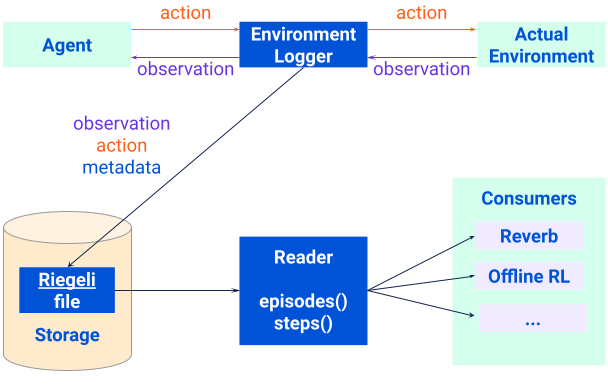
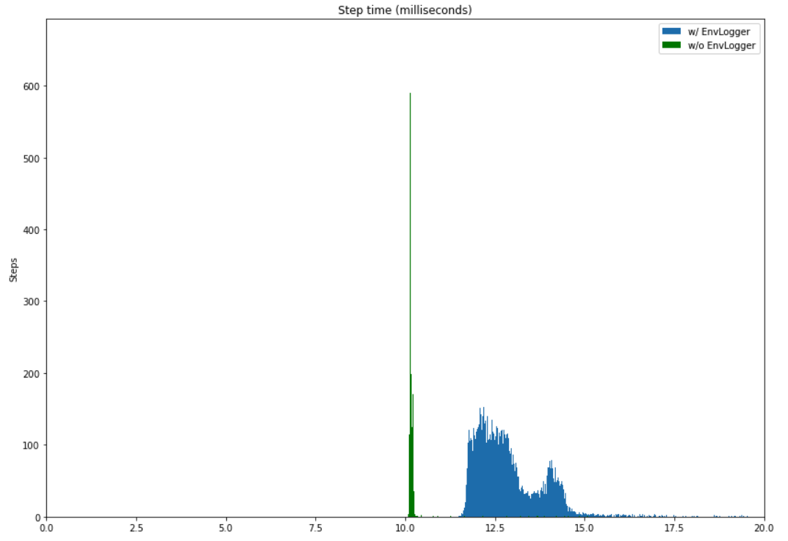

# EnvironmentLogger

`EnvLogger` is a standard `dm_env.Environment` class wrapper that
records interactions between a real environment and an agent. These interactions
are saved on disk as trajectories and can be retrieved in whole, by individual
timesteps or by specific episodes.



## Metadata

To better categorize your logged data, you may want to add some tags in the
metadata when you construct the logger wrapper.  The metadata is written once
per `EnvLogger` instance.

```python
env = envlogger.EnvLogger(
    env,
    data_directory='/tmp/experiment_logs',
    metadata={
        'environment_type': 'dm_control',
        'agent_type': 'D4PG'
    })
```
## How to use Envlogger

Most of the time, it is just a one-liner wrapper, e.g.

```python
import envlogger
from envlogger.testing import catch_env
import numpy as np

env = catch_env.Catch()
with envlogger.EnvLogger(
    env, data_directory='/tmp/experiment_logs') as env:

  env.reset()
  for step in range(100):
    action = np.random.randint(low=0, high=3)
    timestep = env.step(action)
```

Full example of random agent in Catch is available here:
[random_agent_catch.py](https://github.com/deepmind/envlogger/tree/main/envloggerexamples/random_agent_catch.py)


### Step metadata

Envlogger also allows to record custom metadata per step by defining a function
that can be passed to the wrapper. In this example, we want to record the
timestamp of when each step was produced:

```python

  def step_fn(unused_timestep, unused_action, unused_env):
    return {'timestamp': time.time()}

  ...

  with envlogger.Envlogger(
    env,
    data_directory='/tmp/experiment_logs',
    step_fn=step_fn) as env:

  ...

```

### Episode metadata

Recording custom episode metadata is also possible by providing a callback. This
callback is invoked at every step but only the last value returned that is not
`None` (if any) is stored.

In the following example, we only store the timestamp of the first step of the
episode.

```python

  def episode_fn(timestep, unused_action, unused_env):
    if timestemp.first:
      return {'timestamp': time.time()}
    else:
      return None

  ...

  with envlogger.Envlogger(
    env,
    data_directory=FLAGS.trajectories_dir,
    episode_fn=episode_fn) as env:

  ...

```

## Reading stored trajectories

`Reader` can read stored trajectories. Example:

```python
from envlogger import reader

with reader.Reader(
    data_directory='/tmp/experiment_logs') as r:
  for episode in r.episodes:
    for step in episode:
       # step is a step_data.StepData.
       # Use step.timestep.observation, step.timestep.reward, step.action etc...
```

### Reading the dataset with RLDS

Datasets generated with Envlogger are compatible with [RLDS] and you can use
them with [TFDS](http://www.tensorflow.org/datasets) (learn how in the [RLDS]
documentation).

[RLDS]: http://github.com/google-research/rlds

## Getting Started

> EnvLogger currently only supports Linux based OSes and Python 3.

You can install EnvLogger via `pip`:

```
pip install envlogger
```

##### Compiling from source

For this option you will need to [install Bazel](https://docs.bazel.build/versions/main/install.html) and [GMP](https://gmplib.org/) (`libgmp-dev` on Debian-based systems).
Please note that Bazel versions >4.0 are not supported. Our recommended version
is [3.7.2](https://github.com/bazelbuild/bazel/releases/tag/3.7.2). Then:

```
git clone https://github.com/deepmind/envlogger/
cd envlogger
bazel test --test_output=errors envlogger/...
```

##### Running inside Docker

We provide a Docker image that can be used to run tests in a more controlled
environment. You can run it as follows:

```
sh docker/build.sh
docker run -it envlogger bash
bazel test --test_output=errors envlogger/...
```

## Benchmarks

Wrapping your environment with EnvLogger adds an approximately 2 millisecond overhead per environment step.
See the following difference in distributions in the case of random agent on a 100 steps per second Catch environment (measured in milliseconds).

Percentiles      | 50th      | 95th       | 99th      | 99.9th     | mean (± std)
---------------- | --------- | -----------| ----------| -----------| -----------
w/o EnvLogger    | 10.15     | 10.23      | 11.51     | 14.70      | 10.19 (± 1.06)
w/ EnvLogger     | 12.65     | 14.39      | 15.94     | 19.43      | 12.88 (± 0.34)




## Acknowledgements

We greatly appreciate all the support from the
[TF-Agents](https://github.com/tensorflow/agents) team in setting up building
and testing for EnvLogger.
